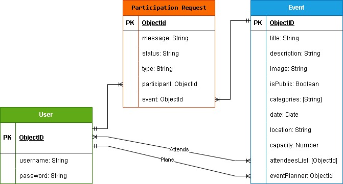

# Project Name
Evently - Full CRUD Event Planner Web App

## Overview

Evently is a full-stack CRUD application that allows users to create and manage events, send invitations, and manage attendees. Event organizers can update event details, review attendance requests, track invitation responses, and control who can attend their events.

Regular users can browse public events, search and filter events, request to attend, view incoming invitations, and respond with Going, Maybe, or Not Going. Users can only edit or delete events they created, ensuring proper authorization and ownership of data.

## Screenshots

## Technologies Used

- Node.js
- Express
- Javascript
- MongoDB
- EJS

## Getting Started

## Installation

## User Stories
- AAU - As a User
- AAG - As a Guest
#### Signed-Out User
- AAG, I want to be able to sign-up using my email and password
- AAG, I want to be able to log-in using the same email and password I signed up with
- AAG, I want to be able to see the homepage
- AAG, I want to be able to see all public events
- AAG, I want to be able to see public event details

#### Logged-In User
- AAU, I want to be able to create public or private events
- AAU, I want to be able to set attendence limits
- AAU, I want to be able to send out event invitations to other users
- AAU, I want to be able to see who is attending my event
- AAU, I want to be able to edit or delete my events
- AAU, I want to be able to accept or reject attendence request
- AAU, I want to be able to view attendee information
- AAU, I want to be able respond to invitations
- AAU, I want to be able to log-out

## Database Design

## Routes

### Main

| HTTP Method |     Route      |        View       |
|:-----------:|:--------------:|:-----------------:|
|     GET     |       /        |    homepage.ejs   |
|     GET     |  /dashboard    |    dashboard.ejs   |
|     GET     |   /profile     |    profile.ejs   |
|     GET     | /auth/log-in   | auth/sign-in.ejs |
|     POST    | /auth/log-in   |        None       |
|     GET     | /auth/sign-up  | auth/sign-up.ejs |
|     POST    | /auth/sign-up  |        None       |
|     POST    | /auth/log-out  |        None       |

### Events

| HTTP Method |       Route                        |         View                |
|:-----------:|:----------------------------------:|:---------------------------:|
|     GET     | /events                            |  events/index.ejs           |
|     GET     | /events/new                        |   events/new.ejs            |
|     POST    | /events                            |         None                |
|     GET     | /events/my-events                  | events/my-events.ejs        |
|     GET     | /events/attending-events           | events/attending-events.ejs |
|     GET     | /events/:eventId                   | events/details.ejs          |
|     GET     | /events/:eventId/edit              |   events/edit.ejs           |
|     PUT     | /events/:eventId                   |         None                |
|    DELETE   | /events/:eventId                   |         None                |
|    DELETE   | /events/:eventId/leave             |         None                |

### Invitations

| HTTP Method |             Route                |           View          |
|:-----------:|:--------------------------------:|:-----------------------:|
|     GET     | /events/invitations              |  invitations/index.ejs  |
|     GET     | /events/:eventId/invitations/new |   invitations/new.ejs   |
|     POST    | /events/:eventId/invitations     |           None          |
|     PUT     | /invitations/:inviteId/accept    |           None          |
|     PUT     | /invitations/:inviteId/decline   |           None          |
|    DELETE   | /invitations/:inviteId/cancel    |                None              |

### Attendance Requests

| HTTP Method |               Route                        |                View              |
|:-----------:|:------------------------------------------:|:--------------------------------:|
|     GET     | /events/attendance-requests                |  attendance-requests/index.ejs   |
|     GET     | /events/:eventId/attendance-requests/new   |   attendance-requests/new.ejs    |
|     POST    | /events/:eventId/attendance-requests       |                None              |
|     PUT     | /attendance-requests/:requestId/accept     |                None              |
|     PUT     | /attendance-requests/:requestId/decline    |                None              |
|    DELETE   | /attendance-requests/:requestId/cancel     |                None              |

## Features

## Future Enhancements

## Credits